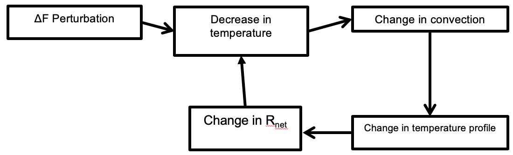
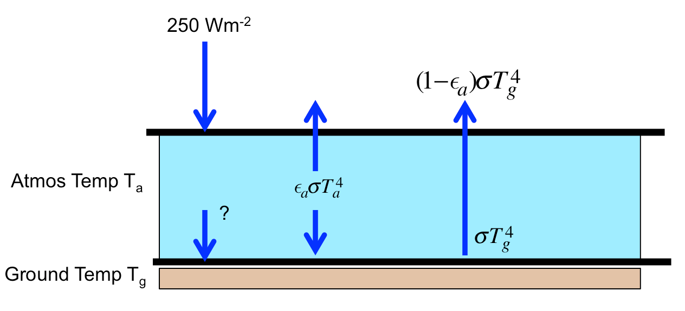

---
header_metadata:
  chead: Quiz 2, February 27, 2020
  lhead: EOSC 340
jupytext:
  cell_metadata_filter: all
  cell_metadata_json: true
  encoding: '# -*- coding: utf-8 -*-'
  formats: ipynb,md:myst
  notebook_metadata_filter: all,-language_info,-toc,-latex_envs
  text_representation:
    extension: .md
    format_name: myst
    format_version: '0.8'
    jupytext_version: 1.4.2
kernelspec:
  display_name: Python 3
  language: python
  name: python3
---

+++ {"answer": " ", "ctype": "question", "key": "A", "qnum": "1", "quesnum": " "}

Name (Last, First):
\_\_\_\_\_\_\_\_\_\_\_\_\_\_\_\_\_\_\_\_\_\_\_\_\_\_\_\_\_\_\_\_\_\_

Student Number:
\_\_\_\_\_\_\_\_\_\_\_\_\_\_\_\_\_\_\_\_\_\_\_\_\_\_\_\_\_\_\_\_

Signature:
\_\_\_\_\_\_\_\_\_\_\_\_\_\_\_\_\_\_\_\_\_\_\_\_\_\_\_\_\_\_\_\_

**This is exam packet (A)**

**Verify that (A) in the ``Test Form'' column of your bubble sheet has been marked**

**Instructions:** You may detach the Bubble sheet (first page) and the
Equation Sheet (last page) from this exam package. No notes, books,
cellphones or aids are allowed. Calculators are okay.
Only answers indicated on the provided Bubble sheet will be marked.
You must submit both this ``question book'' as well as the Bubble sheet
before leaving the room.

**Course Statistics** Find the `HOURS STUDIED` area on your Bubble sheet. In the past week, how much time did you spend studying for this exam? Please enter your answer in the `HOURS STUDIED` area of your Bubble sheet. Round to the nearest hour. If, for example, you spent 2 hours studying, enter `002`. If, for example, you spent 14 hours studying, enter `014`.

**This exam booklet should contain 9 questions.**

```{raw-cell}
:ctype: question
:key: A
:qnum: '0'

<brk></brk>
```

+++ {"ctype": "question", "key": "A", "qnum": "1"}

Q1) Suppose we think the climate sensitivity is 4.5 degrees per doubled $CO_2$.  If we increase the $CO_2$ concentration from 280 ppm to 700 ppm,
    what will be the final temperature change we expect for the new equilibrium climate? Choose the closest answer.  (Hint: you can find ΔF for doubled
    $CO_2$ from the radiative forcing equation in the equation sheet.

A) 7 deg  
B) 6 deg  
C) 5 deg  
D) 4 deg  
E) 3 deg

```{code-cell} ipython3
:ctype: answer
:key: A
:qnum: '1'

import numpy as np
the_lambda = 4.5/3.8
del_F = 3.8*np.log(700/280)/np.log(2)
T_equil = the_lambda*del_F
print(f"Tequil is {T_equil:5.2f} degrees -- B)")
```

+++ {"ctype": "question", "key": "A", "qnum": "2"}

Q2) For this feedback loop:



+++ {"ctype": "question", "key": "A", "qnum": "2"}

 
Choose the best characterization, keeping in mind that feedbacks
work in both directions.  ($R_{net}$ is the net longwave downward radiation at the top of the atmosphere)

A) Amplifying because convection will change the temperature profile to make $R_{net}$ more negative  
B) Amplifying because convection will change the temperature profile to make $R_{net}$ more positive  
C) Stabilizing because convection will change the temperature profile to make $R_{net}$ more negative  
D) Stabilizing because convection will change the temperature profile to make $R_{net}$ more positive  
E) Changes in the temperature profile due to convection could be either amplifying or stabilizing

+++ {"ctype": "answer", "key": "A", "qnum": "2"}

Q2 Answer D)

+++ {"ctype": "question", "key": "A", "qnum": "3"}

Q3) Consider the following shallow, nocturnal atmospheric layer with
    emissivity **$ε_a$=0.8** over ground with emissivity of ε=1. If
    the ground temperature $T_g$ is 300 K and the air
    temperature $T_a$ is 260 K, what is heating rate of the atmosphere
    in $W\,m^{-2}$ (include sign). Choose the closest answer

   (Note 250 $W\,m^{-2}$ in longwave flux is entering the layer from above)

   Shortcut:  $\sigma \times 300^4 = 460\ W\,m\,^{-2}$ and $\sigma \times 260^4$ is 260 $W\,m^{-2}$

+++ {"ctype": "question", "key": "A", "qnum": "3"}

      


+++ {"ctype": "question", "key": "A", "qnum": "3"}

      
   A) +250 $W\,m^{-2}$  
   B) +150 $W\,m^{-2}$  
   C) +0 $W\,m^{-2}$  
   D) -150 $W\,m^{-2}$  
   E) -250 $W\,m^{-2}$

```{code-cell} ipython3
:ctype: answer
:key: A
:qnum: '3'

sigma=5.67e-8
print(sigma*300**4., sigma*260**4.)
top = +250 - 0.8*260 - 0.2*460
bot = 250*0.2 + 0.8*260 - 460.
print((top - bot), "B)")
```

```{raw-cell}
:ctype: question
:key: A
:qnum: '0'

<brk></brk>
```

+++ {"ctype": "question", "key": "A", "qnum": "4"}

Q4) Which of the following climate feedbacks are always stabilizing?  
      
i.  cloud feedback  
ii. Lapse rate feedback    
iii. Water vapour feedback   
iv.  Planck feedback

      
A) i, iii  
B) ii, iv  
C) iv  
D) i, iii, iv  
E) ii,iii

+++ {"ctype": "answer", "key": "A", "qnum": "4"}

Q4 answer is #B

+++

```{math}
:label: my_label
\int_\alpha^\beta \cos ( \alpha ) \, dx
```

+++ {"ctype": "question", "key": "A", "qnum": "5"}

Q5) From the readings water vapor feedback can be written as:

\begin{align*}
f = \left( \frac{\Delta R}{\Delta \mbox{H2O}} \right) \times \left( \frac{\Delta\mbox{H2O}} {\Delta T} \right )
\end{align*}

Which of the following statements is correct?

\begin{align*}
A) \left( \frac{\Delta R}{\Delta \mbox{H2O}} \right ) \mbox{is positive}  \left( \frac{\Delta \mbox{H2O}} {\mbox{ΔT}} \right ) \mbox{is positive} \\
B) \left( \frac{\Delta R}{\Delta \mbox{H2O}} \right ) \mbox{is positive}  \left( \frac{\Delta \mbox{H2O}} {\mbox{ΔT}} \right ) \mbox{is negative} \\
C) \left( \frac{\Delta R}{\Delta \mbox{H2O}} \right ) \mbox{is negative} \left( \frac{\Delta \mbox{H2O}} {\mbox{ΔT}} \right ) \mbox{is positive} \\
D) \left( \frac{\Delta R}{\Delta \mbox{H2O}} \right ) \mbox{is negative} \left( \frac{\Delta \mbox{H2O}} {\mbox{ΔT}} \right ) \mbox{is negative} \\
E) \left( \frac{\Delta R}{\Delta \mbox{H2O}} \right ) \mbox{is negative} \left( \frac{\Delta \mbox{H2O}} {\mbox{ΔT}} \right ) \mbox{is positive} \\
\end{align*}

+++ {"ctype": "answer", "key": "A", "qnum": "5"}

Q5 Answer A)

+++ {"ctype": "question", "key": "A", "qnum": "6"}

Q6) Consider an atmosphere with moist adiabatic lapse rate of $\Gamma_m$=-6.5 K/km. 
A cloud is formed at 500 m above the ground. If the cloud travels Δz=1500 m upwards before it 
reaches the inversion layer, what is the change in $Δw_v$ during ascent? 
Assume that the cloud rises moist adiabatically, conserving moist static energy. Choose the closest answer. 

A) -0.001 g/kg  
B) -0.01 g/kg  
C) -0.1 g/kg  
D) -1 g/kg  
E) -10 g/kg

```{code-cell} ipython3
:ctype: answer
:key: A
:qnum: '6'

c_p = 1004
L_v = 2.5e6
g = 9.8
delta_T = -6.5
delta_z = 1000

delta_wv = -(delta_T * c_p + delta_z * g)/L_v # kg/kg
print(f"{delta_wv * 1e3} g/kg -- D)")
```

+++ {"ctype": "question", "key": "A", "qnum": "7"}

7) The climate sensitivity can be calculated as a sum of each individual climate feedback factor. Namely,

$$
\lambda = - \frac{1}{\sum f_i} = - \frac{1}{(f_\text{PL} + f_\text{WV} + f_\text{Alb} + f_\text{LR} + f_\text{Cl})},
$$

which is roughly estimated for current climate at 0.85 K (W m$^{-2}$)$^{-1}$. Suppose, that all the ice were to 
melt on the Earth and the ice-albedo feedback became $f_{Alb}=0$. Given that we currently measure the 
ice-albedo feedback factor to be roughly $f_{Alb}$ = 0.25 W m$^{-2}$ K$^{-1}$, and assuming that all the 
other feedback processes remain the same, what will be the new climate sensitivity without the ice? 
Choose the closest answer.

A) 0.7 K / W m$^{2}$  
B) 1.1 K K / W m$^{2}$  
C) 1.7 K / W m$^{2}$  
D) 2.1 K / W m$^{2}$  
E) 2.7 K / W m$^{2}$

```{code-cell} ipython3
:ctype: answer
:key: A
:qnum: '7'

f = - 1 / 0.85
lambda_new = - 1 / (f - 0.25)
print(f"New climate sensitivity is {lambda_new:5.2f} K/W/m2 -- answer A)")
```

```{raw-cell}
:ctype: question
:key: A
:qnum: '0'

<brk></brk>
```

+++ {"ctype": "question", "key": "A", "qnum": "8"}

Q8) Which of the following statements about greenhouse effect is false?

A) Cooling the atmosphere increases the greenhouse effect   
B) Water vapour is the most effective greenhouse gas per mole.  
C) An atmosphere where the temperature is independent of height has no greenhouse effect.   
D) Greenhouse gases rarely interact with solar radiation, with the exception of Ozone    
E) None of the above

+++ {"ctype": "answer", "key": "A", "qnum": "8"}

Q8 Answer B)

+++ {"ctype": "question", "key": "A", "qnum": "9"}

Q9) As of January 2020, the average monthly level of CO$_2$ measured at 
Mauna Loa Observatory reached 413 ppm. Assuming a
climate sensitivity of $\lambda \approx 0.8$ K (W m$^{-2}$)$^{-1}$, estimate 
the maximum permissible CO$_2$ concentration to keep the global temperature 
increase from this time forward below 1 $^\circ$C. Choose the closest answer.

A) 300 ppm  
B) 350 ppm  
C) 450 ppm  
D) 500 ppm  
E) 550 ppm

```{code-cell} ipython3
:ctype: answer
:key: A
:qnum: '9'

del_F = 1 / 0.8
old_CO2 = 413
new_CO2 = np.exp(del_F* np.log(2) / 3.8) * old_CO2

print(f"{new_CO2} is the maximum permissible level of CO2 concentration  -- answer D")
```

```{raw-cell}
:ctype: question
:key: A
:qnum: '0'

<brk></brk>
```

And here is a reference to equation (\ref{eq:trythis})

+++ {"answer": " ", "ctype": "question", "key": "A", "qnum": "1"}

\begin{align}
\label{eq:reference}
\text{Layer energy equation:} ~~~ & \frac { d E } { d t } = I _ { \downarrow } + I _ { \uparrow }\\
\text{Solar constant:}~~~& S= \frac { S _ { 0 } } { 4 } ( 1 - \alpha )\\
\text{Total grey body flux} ~~~ & I = \varepsilon \sigma T ^ { 4 }\\
&\text{where} ~~~ \sigma = 5.67 \times 10 ^ { - 8 } \mathrm { Wm } ^ { - 2 } \mathrm { K } ^ { - 4 }\nonumber\\
\text{transmissivity tr:}~~~& I _ { \text {transmitted } } = \mathrm { tr } I _ { 0 }\\
\text{reflectity}~ \alpha~~~ & I _ { \text {reflected } } = \alpha I _ { 0 } \\
\text{absorbtivity abs} ~~~ & I _ { \text {absorbed} } = \text{abs} I _ { 0 }\\
\text{Kirchoff's law} ~~ & \varepsilon = \text{abs} \\
\text{$CO_2$ radiative forcing} ~~~& \Delta F = \left(3.8 \mathrm{W} \mathrm{m}^{ - 2 } \right) \frac { \ln ( \text {newp} \operatorname { CO } 2 / \text { origp } \mathrm { CO } 2 ) } { \ln ( 2 ) } \\
\text{Conservation of Energy:}~~~&\alpha \mathrm { I } _ { 0 } + a b s \mathrm { I } _ { 0 } + \mathrm { trI } _ { 0 } = \mathrm { I } _ { 0 }\\
\text{moist static energy:}~~~ & h _ { m } = c _ { p } T + l _ { v } w _ { v } + g z \\
\text{moist adiabatic lapse rate:}~~~&\Gamma = \frac { d T } { d z } = \frac { - g } { c _ { p } + l _ { v } \frac { d w _ { v } } { d T } }\\
\text{hydrostatic balance:}~~~&d p = - \rho g d z \\
\text{mass in a layer in $kg/m^2$:}~~~&M = \int _ { z _ { 1 } } ^ { z _ { 2 } } \rho(z) d z\\
\text{energy in an ocean layer:}~~~&\Delta E=\rho_{w} D c_{w} \Delta T\\
\text{Conservation of energy for layer:}~~~&\frac{d \Delta E}{d t}=\Delta F\\
\text{change of temperature for an ocean layer:}~~~&\frac{d \Delta T}{d t}=\frac{\Delta F}{\rho_{w} c_{w} D}\\
\text{Planck feedback:}~~~&\frac { d I _ { G } } { d T } = \frac { d \left( - \sigma T ^ { 4 } \right) } { d T } = f_{planck} =- 4 \sigma T ^ { 3 } = - 1 / \lambda\\
\text{Conservation of energy with feedback:}~~~&
\frac { \Delta E } { d t } = \Delta F - 4 \sigma T ^ { 3 } \Delta T\\
\text{Climate adjustment to abrupt forcing:}~~~&\Delta T ( t ) = \lambda \Delta F \left( 1 - e ^ { - t / \tau } \right) \\
\text{Climate adjustment timescale:}~~~&\tau = \rho _ { w } c _ { w } D \lambda\\
\text{Climate sensitivity:}~~~&\Delta T = \lambda \Delta F\\
\text{Climage mean temperature budget:}~~~&\rho _ { w } c _ { w } D \frac { d T } { d t } = \Delta F + \sum f _ { n } \Delta T\\
\text{Climate feedback factor:}~~~&f _ { n } = \frac { \Delta R } { \Delta T } = \left( \frac { \Delta R } { \Delta \text { climate } } \right) \left( \frac { \Delta \text { climate } } { \Delta T } \right)\\
\text{Climate sensitivity with feedbacks:}~~~&\lambda = - \frac { 1 } { \sum f _ { n } }
\end{align}

+++ {"answer": " ", "ctype": "question", "key": "A", "qnum": "1"}

# Quiz 2 constants

\begin{align}
&\text{1 ppm = 2.1 Gtonnes Carbon = 7.6 Gtonnes $CO_2$}\\
\sigma  &= 5.67 \times 10 ^ { - 8 } \mathrm { Wm } ^ { - 2 } \mathrm { K } ^ { - 4 }\\
c_p  &= 1004\ J\,kg^{-1}\,K^{-1} \\
c_w  &= 4186\ J\,kg^{-1}\,K^{-1} \\
\rho_w &= 1000\ kg\,m^{-3}\\
l_v &= 2.5 \times 10^6\ J\,kg^{-1}
\end{align}
